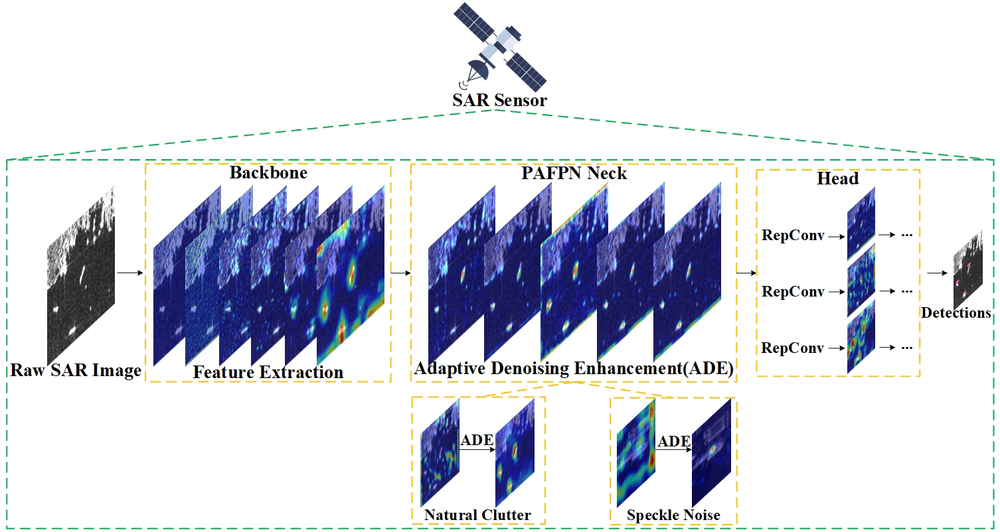

# [ADERLNet: Adaptive Denoising Enhancement Representation Learning for Low-Latency and High-Accurate Target Detection on SAR Sensors](https://ieeexplore.ieee.org/document/10382453)


<div align="center"></div>


## SAR image detection results

     


## Speed-accuracy trade-offs


## Performance 
Note: All the pre-trained ADERLNet weight links lead to a Baidu Netdisk address with the extraction code: bahy.
### On SSDD

|Model |size |AP <br/>(%) |AP<sup>50 <br/>(%)| AP<sup>75 <br/>(%) |FPS | Params<br>(M) |FLOPs<br>(G)| weight |
| ------ |:---: | :---: | :---:  |:---: |:---:  | :---: | :----: | :----: |
|ADERLNet-CW|640|0.698 |0.985 |0.855 |95.24 | 38.96 | 105.20 | [Baidu Netdisk](https://pan.baidu.com/s/1zx3k6UpUaE_mhNXlu083SQ) |
|aggregated ADERLNet-CW|640|0.684 |0.983|0.795|129.87 |37.31 | 103.80 | [Baidu Netdisk](https://pan.baidu.com/s/1zx3k6UpUaE_mhNXlu083SQ) |
|ADERLNet-CS|640|0.691|0.977|0.831|94.34|37.73 | 104.20 | [Baidu Netdisk](https://pan.baidu.com/s/1zx3k6UpUaE_mhNXlu083SQ) |
|aggregated ADERLNet-CS|640|0.679|0.976|0.811|123.46|36.89 |103.50 | [Baidu Netdisk](https://pan.baidu.com/s/1zx3k6UpUaE_mhNXlu083SQ) |

### On MSAR-1.0
|Model |size |AP <br/>(%) |AP<sup>50 <br/>(%)| AP<sup>75 <br/>(%) |FPS | Params<br>(M) |FLOPs<br>(G)| weight |
| ------ |:---: | :---: | :---:  |:---: |:---:  | :---: | :----: | :----: |
|ADERLNet-CW|640|0.644 |0.936 |0.685 |105.3 | 38.97 | 105.20 | [Baidu Netdisk](https://pan.baidu.com/s/1zx3k6UpUaE_mhNXlu083SQ) |

### On SAR-Ship-Dataset
|Model |size |AP <br/>(%) |AP<sup>50 <br/>(%)| AP<sup>75 <br/>(%) |FPS | Params<br>(M) |FLOPs<br>(G)| weight |
| ------ |:---: | :---: | :---:  |:---: |:---:  | :---: | :----: | :----: |
|ADERLNet-CW|640|0.656 |0.958 |0.778 |106.4 | 38.96 | 105.20 | [Baidu Netdisk](https://pan.baidu.com/s/1zx3k6UpUaE_mhNXlu083SQ) |

## Quick Start

<details>
<summary>Installation</summary>

Install ADERLNet from source
```shell
git clone https://github.com/yangyahu-1994/ADERLNet.git
cd ADERLNet
pip3 install -U pip && pip3 install -r requirements.txt
```

<details>


## Testing

``` shell
python test.py --data data/coco.yaml --img 640 --batch 32 --conf 0.001 --iou 0.65 --device 0 --weights yolov7.pt --name yolov7_640_val
```

You will get the results:

```
 Average Precision  (AP) @[ IoU=0.50:0.95 | area=   all | maxDets=100 ] = 0.51206
 Average Precision  (AP) @[ IoU=0.50      | area=   all | maxDets=100 ] = 0.69730
 Average Precision  (AP) @[ IoU=0.75      | area=   all | maxDets=100 ] = 0.55521
 Average Precision  (AP) @[ IoU=0.50:0.95 | area= small | maxDets=100 ] = 0.35247
 Average Precision  (AP) @[ IoU=0.50:0.95 | area=medium | maxDets=100 ] = 0.55937
 Average Precision  (AP) @[ IoU=0.50:0.95 | area= large | maxDets=100 ] = 0.66693
 Average Recall     (AR) @[ IoU=0.50:0.95 | area=   all | maxDets=  1 ] = 0.38453
 Average Recall     (AR) @[ IoU=0.50:0.95 | area=   all | maxDets= 10 ] = 0.63765
 Average Recall     (AR) @[ IoU=0.50:0.95 | area=   all | maxDets=100 ] = 0.68772
 Average Recall     (AR) @[ IoU=0.50:0.95 | area= small | maxDets=100 ] = 0.53766
 Average Recall     (AR) @[ IoU=0.50:0.95 | area=medium | maxDets=100 ] = 0.73549
 Average Recall     (AR) @[ IoU=0.50:0.95 | area= large | maxDets=100 ] = 0.83868
```

To measure accuracy, download [COCO-annotations for Pycocotools](http://images.cocodataset.org/annotations/annotations_trainval2017.zip) to the `./coco/annotations/instances_val2017.json`


## Transfer learning

Single GPU finetuning for custom dataset

``` shell
# finetune p5 models
python train.py --workers 8 --device 0 --batch-size 32 --data data/custom.yaml --img 640 640 --cfg cfg/training/yolov7-custom.yaml --weights 'yolov7_training.pt' --name yolov7-custom --hyp data/hyp.scratch.custom.yaml

# finetune p6 models
python train_aux.py --workers 8 --device 0 --batch-size 16 --data data/custom.yaml --img 1280 1280 --cfg cfg/training/yolov7-w6-custom.yaml --weights 'yolov7-w6_training.pt' --name yolov7-w6-custom --hyp data/hyp.scratch.custom.yaml
```

## References
Thanks to their great works:

- [WongKinYiu/yolov7](https://github.com/WongKinYiu/yolov7)
